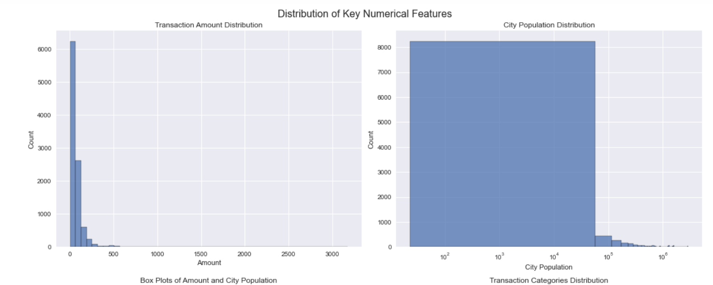
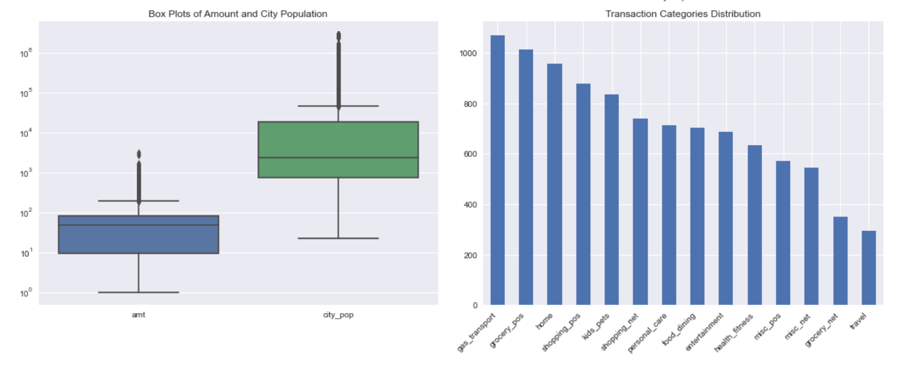
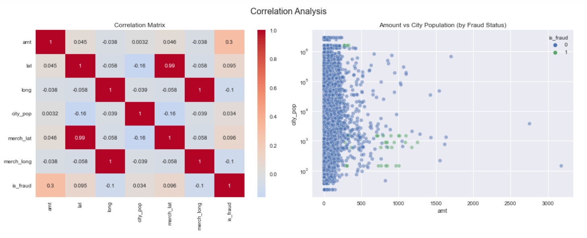
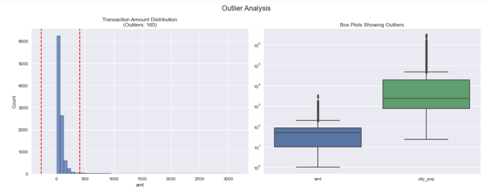

# Credit Card Fraud Detection System

## Overview
This project implements a machine learning model for detecting fraudulent transactions in credit card data using Random Forest classification with SMOTE balancing. The system achieved 96.7% precision and 81.9% recall on fraud detection.

## Dataset Description
- **Total Records**: 616,615
- **Size**: 112.9+ MB
- **Missing Values**: Only in merch_zipcode (93,225 missing)
- **Class Distribution**: 0.47% fraudulent transactions

### Key Features
#### Transaction Information
- Transaction timestamp
- Transaction amount
- Fraud status (target variable)
- Merchant category
- Merchant location (lat/long)

#### Cardholder Information
- Geographic location (lat/long)
- City population
- Gender
- Job information

## Data Analysis and Visualization

### Distribution of Key Numerical Features

- Left: Transaction amount distribution shows heavy right skew
- Right: City population distribution on logarithmic scale shows concentration in smaller cities

### Transaction Categories and Value Ranges

- Left: Box plots show distribution of transaction amounts and city populations
- Right: Bar chart shows frequency of different transaction categories, with gas_transport and grocery_pos being most common

### Correlation Analysis

- Left: Correlation matrix showing relationships between numerical features
- Right: Scatter plot of amount vs city population, colored by fraud status
- Key findings:
  - Strong correlation between merchant and cardholder locations
  - Weak correlation between amount and fraud status
  - City population shows minimal correlation with other features

### Outlier Analysis

- Left: Transaction amount distribution with outlier boundaries
- Right: Box plots highlighting outliers in amount and city population
- Outliers appear to be legitimate data points following expected patterns

## Data Preprocessing

### Feature Selection
#### Removed Columns
- Unnamed index
- Personal identifiers (first/last name, street)
- Redundant location data (city, state, zip)
- Transaction IDs
- Redundant timestamps

### Data Cleaning
- Handled missing values in merch_zipcode
- Verified no duplicate transactions
- Processed datetime features into hour, day, week, month components

### Feature Engineering
- Encoded categorical variables:
  - Label encoding for gender
  - One-hot encoding for transaction categories
  - One-hot encoding for merchant names
- Extracted temporal features from transaction timestamps

## Model Architecture

### Random Forest Classifier
- 300 trees
- No maximum depth restriction
- Balanced class weights
- Utilized SMOTE for handling class imbalance

### Cross-Validation
- 5-fold stratified cross-validation
- Maintained class distribution across folds

## Performance Metrics

### Final Model Results
- Precision: 96.7%
- Recall: 81.9%
- F1-score: 0.879
- Consistent performance across validation folds

### Feature Importance
1. Transaction amount (26.6%)
2. City population (11.1%)
3. Geographic features (significant contribution)

## Key Insights
- Transaction amount is the strongest predictor of fraud
- Geographic and temporal patterns contribute significantly
- Model performs well at minimizing false positives while maintaining good fraud detection rate

## Improvements Made
- Enhanced recall from 47.6% to 81.9%
- Maintained high precision
- Reduced performance variance across folds
- Successfully handled class imbalance through combined SMOTE and class weights approach

## Notes
- Model optimized for real-world fraud detection scenarios
- Validation performed on original distribution data
- Feature engineering focused on fraud-relevant patterns
