This a group project for a Big Data Analytics (ICS-474) course at King Fahd University of Petroleum and Minerals

Group Members:

    •	Hashem Almubarak (ID: 2020122260)
    •	Haidar Alnasser (ID: 202027820)
    •	Abdullah Alfateel (ID: 202037380)

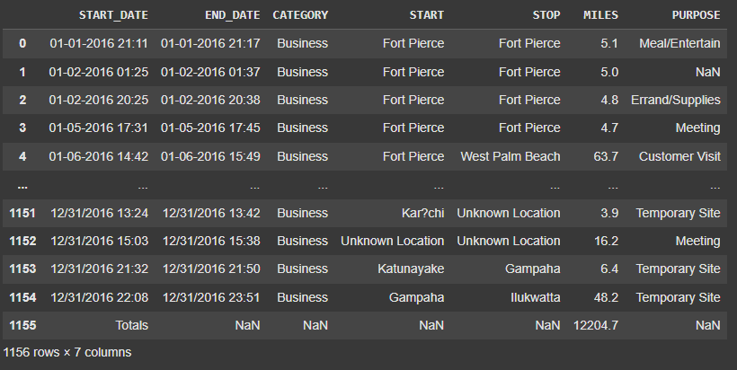

To run the code provided in this folder, the following libraries should be installed:

- matplotlib
- seaborn
- sklearn
- pandas
- numpy
- imblearn

It is recommended to run the python note on Google Colab to avoid downloading any libraries. However, you can use the following command to download the required libraries.

    !pip install matplotlib seaborn scikit-learn pandas numpy imbalanced-learn

# Editing Dataset

We encountered an issue where we thought there is a row that has missing values,
and we treated it as noise in the dataset.

The purpose of the additional row is to calculate the total miles of all the trips.

We used `df = df.iloc[:-1]` to get rid of that row.

# Part 1: Data Understanding and Exploration:

## 1. Dataset Overview

### - What is the source and context of your chosen dataset?

_Provide a brief description of the dataset, including its origin and the problem domain it addresses._

- The source of the dataset is Uber, a multinational transportation company that connects riders to drivers through a mobile app.

- The dataset contains information about some of the rides the company conducted in a specified period, providing data for analysis in the public transportation sector.

- Companies could analyze this dataset to recognize what category to target in order to attract more customers. This could also help them prepare drivers by aknowledging the average distance a ride might take.

## 2. Feature Description

### - What are the features (variables) present in the dataset? Is there a target variable?

_List all the features, their data types (e.g., numerical, categorical), and describe their significance._

1. **START_DATE (Categorical)**: Represents the date and time when the trip began. Significant for understanding trip timing.
2. **END_DATE (Categorical)**: Indicates the date and time when the trip ended. Important for tracking trip duration.
3. **CATEGORY (Categorical)**: Classifies the type of trip (e.g., business or personal). Useful for distinguishing trip purposes.
4. **START (Categorical)**: Specifies the starting location of each trip. Helps in analyzing common departure points.
5. **STOP (Categorical)**: Indicates the end location of each trip. Complements START for route analysis.
6. **MILES (Numerical)**: Shows the total distance of the trip in miles. Crucial for distance-based insights.
7. **PURPOSE (Categorical)**: Represents the reason for the trip (e.g., meetings, errands). Helps in categorizing trip types.

## 3. Dataset Structure

### - What is the size and structure of the dataset?

- _Mention the number of rows and columns, and any hierarchical structure if applicable._

We used `df.info()` to display the rows and columns of the dataset.

    <class 'pandas.core.frame.DataFrame'>
    RangeIndex: 1155 entries, 0 to 1154
    Data columns (total 7 columns):
    #   Column      Non-Null Count  Dtype
    ---  ------      --------------  -----
    0   START_DATE  1155 non-null   object
    1   END_DATE    1155 non-null   object
    2   CATEGORY    1155 non-null   object
    3   START       1155 non-null   object
    4   STOP        1155 non-null   object
    5   MILES       1155 non-null   float64
    6   PURPOSE     653 non-null    object
    dtypes: float64(1), object(6)
    memory usage: 63.3+ KB

The dataset has 7 columns and 1155 rows.

The data in this dataset could be categorized by the year, month or day, having the date hierarchy: Year > Month > Day

## 4. Missing Values and Duplicates

### - Are there missing values or duplicates in the dataset?

- _Identify any missing or duplicate entries and discuss how they might affect your analysis_

We used `missing_values = df.isnull().sum()` and `duplicate_rows = df.duplicated().sum()` to calculate the missing and duplicate entries.

    Missing Values per Column:
    START_DATE      0
    END_DATE        0
    CATEGORY        0
    START           0
    STOP            0
    MILES           0
    PURPOSE       502
    dtype: int64

    Total Duplicate Rows: 1

- For the Duplications: we will remove the row to ensure that our analysis will not be biased considering the repeated rows.

- For Columns: there are no missing values except for purpose.

- For the purpose column: We will fill the missing fields with 'Unknown' so we can preserve the data, we can drop the column or rows but since the datasets are small and the data is small too.

## 5. Statistical Summary

### What is the statistical summary of the dataset?

- _Compute summary statistics like mean, median, standard deviation, and provide initial insights._
  ```
  The mode of the trip categories is Business
  The mean of the trip miles is 10.5668
  The median of the trip miles is 6.0
  The standard deviation of the trip miles is 21.5698
  The mode of the trip start locations is Cary
  The mode of the trip stop locations is Cary
  The mode of the trip purposes is Meeting
  ```
  - It appears that most of the type of trips are meant for business reasons.
  - The average miles a trip covers is 10.5 miles.
  - Half of the trips are 6 miles or shorter.
  - A standard deviation of 21, indicates that outliers and extreme values have less infleunce on the spread of the data.
  - Most of the trips start and stop at Cary.
  - Most of the trips are meant for going to business meetings.

## 6. Data Distribution

### How are the features distributed?

- _Use visualizations like histograms or box plots to show the distribution of key features_

1. Visualizing the distribution of numerical features:
   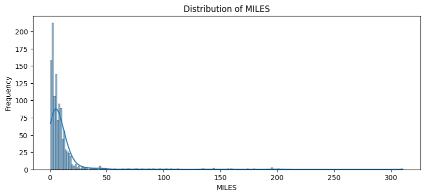

2. Visualizing the distribution of categorical features:
   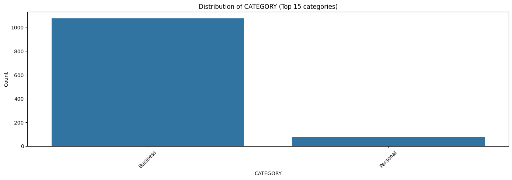
   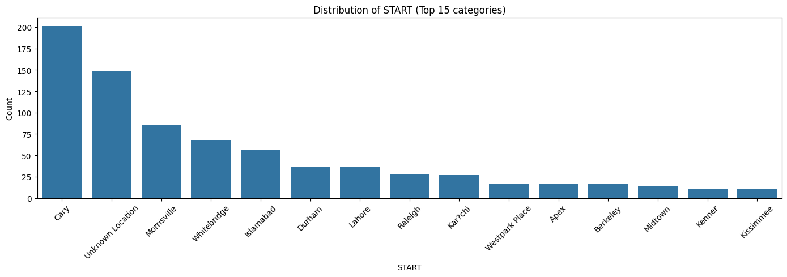
   
   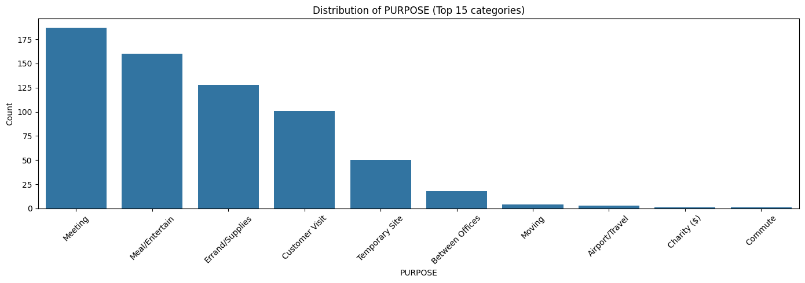

   ```
   1. MILES Distribution: Shows most trips cover short distances, with few long-distance trips indicating outliers.

   2. CATEGORY Distribution: Most trips are for “Business,” with fewer “Personal” trips.

   3. START and STOP Locations: Highlights the top 15 most frequent start and stop locations, with “Cary” and “Unknowm Location” as the most common.

   4. PURPOSE Distribution: “Meeting” and “Meal/Entertain” are the most common purposes for trips, with other purposes being less frequent.
   ```

## 7. Correlation Analysis

### What is the relationship between different features and the target variable?

- _Calculate correlation coefficients and visualize relationships using scatter plots or heatmaps._

We encoded the categorical data using `LabelEncoder()` in the sklearn library to perform a more accurate correlation analysis.

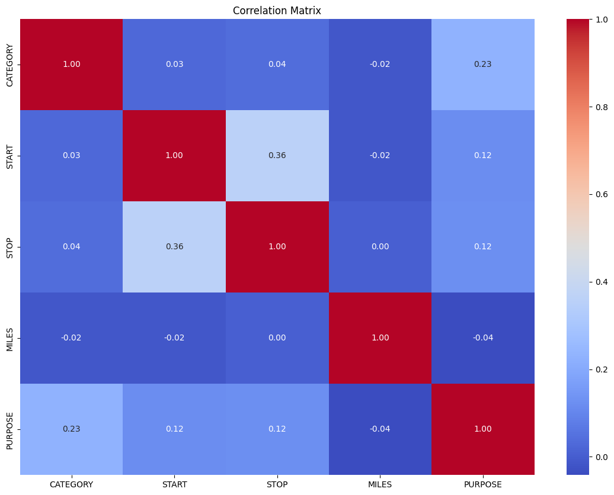

The correlation analysis shows weak relationships between features, with `START` and `STOP` having a moderate correlation (0.36). `CATEGORY` and `PURPOSE` show a modest link (0.23). `MILES` is mostly independent of other features. This suggests minimal linear dependencies in the data.

The correlation matrix using the original columns in the dataset was not enough for us to decide our target variable. That is why we decided to perform **Exploratory Data Analysis (EDA)**

We made use of functions to extract more columns such as `PERIOD` and `DURATION`.

Functions are defined as `calculate_duration(df)`, which takes a dataframe as its input, and appends a new column called `DURATION` that holds the duration of the trips in minutes. The other function is called `get_period(hour)`, which takes the hour at which the trip started and return the corresponding period.

We also detected that the date values were recorded in the dataset in two different formats. In order to reformat the date columns, we used the function `reformat_date(date)` that takes the date of the `dd-mm-yy` format and converts it to the `dd/mm/yy` format.

## Exploratory Data Analysis

### Using Exploratory Data Analysis (EDA) to figure out relationships between extracted columns such as Period, Duration, etc...

- Correlation matrix output with the newly extracted columns:

  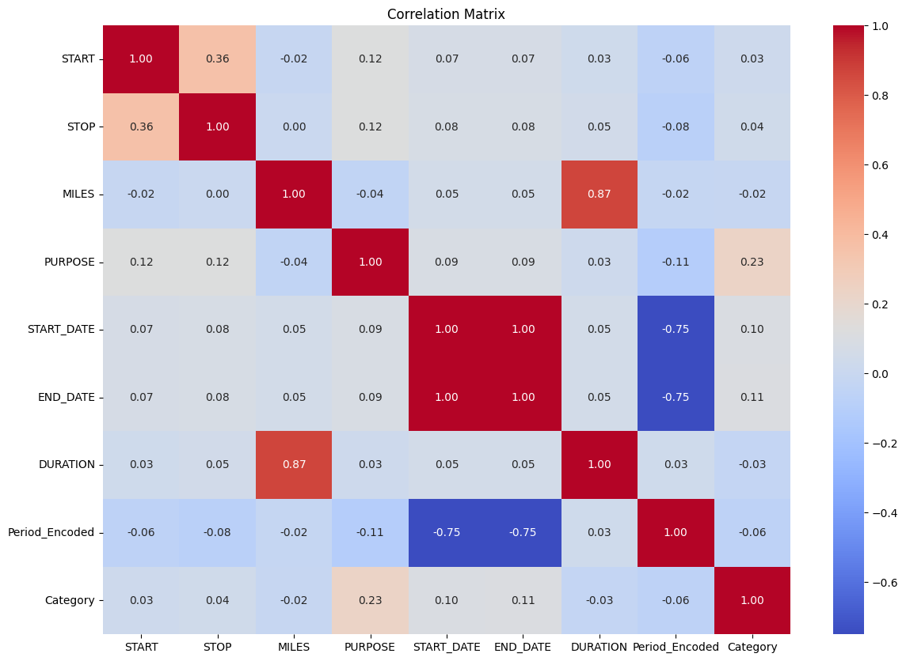

- Category vs Period

  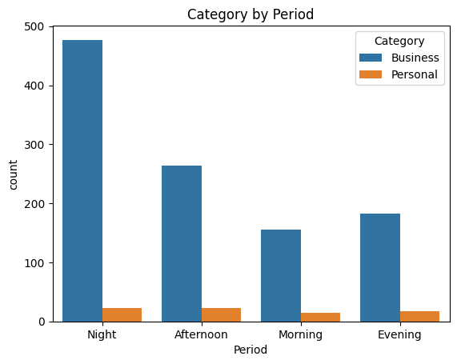

- Category vs Duration Intervals

  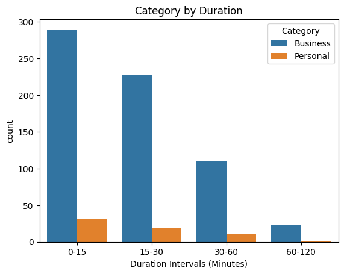

- Category vs Duration Intervals vs Period

  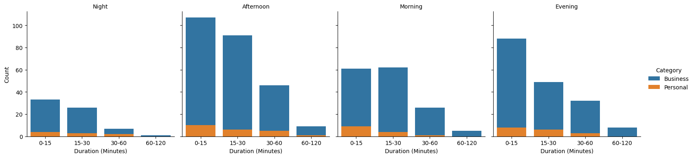

- Category vs Miles Intervals vs Period

  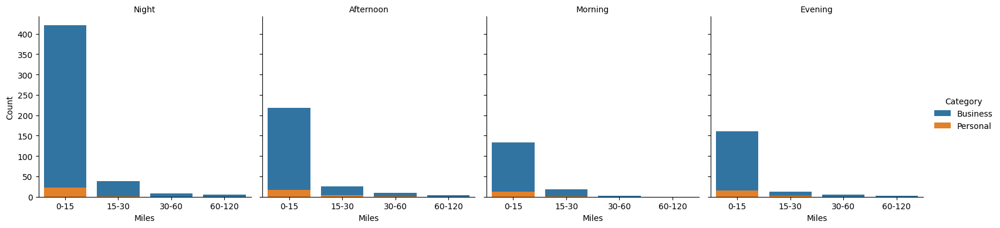

- Miles vs Duration Intervals vs Category plot

  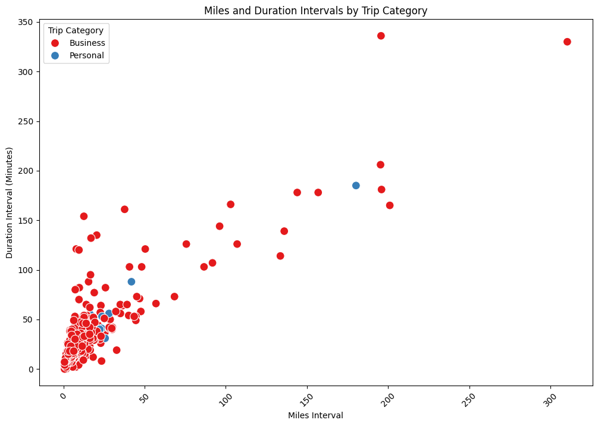

## 8. Outlier Detection

### Are there any outliers or anomalies in the data?

- _Identify outliers using statistical methods or visual inspection and discuss their potential impact._

We used a boxplot to detect the outliers in the `MILES` column.

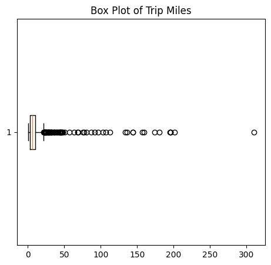

Although the visualization shows that there exist multiple outliers in the dataset, we are only going to remove extreme values/outliers due to the short amount of data available. Most of the outliers are also packed together, which gives us another reason not to remove them.

We will experiment with the removal of the outlier subsets to see which one gives us the best analysis.

# Part 2: Data Preprocessing

## 9. Handling Missing Data

### How will you handle missing or anomalous data?

- _Strategy: Explain how you plan to deal with missing values, whether through imputation (e.g., mean, median, mode) or deletion. Justify your choice based on the significance of the data and the potential impact on the analysis._

  ```
  • Numerical Data: Using median imputation for columns like MILES and DURATION to maintain data consistency without being influenced by outliers.

  • Categorical Data: Applying mode imputation for columns such as PERIOD, DAY_OF_WEEK, START_ENCODED, and STOP_ENCODED to fill gaps with the most common values, preserving typical patterns.

  • Deletion: Removing rows with extensive missing data when imputation isn’t feasible, ensuring data quality and model reliability.
  ```

  Almost half of the rows in the dataset have a `null` value in the `PURPOSE` column. We can not remove these values since the dataset is already really small. However, the disadvantage of doing this is that we will not be able to use this column as a dependent nor independent variable.

  We used `df['PURPOSE'].fillna('Unknown', inplace=True)` to fill the null values in the `PURPOSE` column.

## 10. Encoding Categorical Variables

### Are there categorical variables that need to be encoded?

- _Strategy: Describe the encoding techniques to be used (e.g., one-hot encoding, label encoding) and explain why these methods are appropriate for your dataset._

  For the dataset, categorical variables need to be encoded to ensure compatibility with machine learning models. The selected approach includes:

      • Label Encoding for variables like PERIOD (Morning, Afternoon, etc.) and DAY_OF_WEEK (Monday, Tuesday, etc.), mapping them to integers. This method is effective for these columns as it maintains simplicity while introducing no ordinal bias.
      • One-Hot Encoding for columns like START and STOP, which may contain unique labels without a natural order. This method converts these categorical features into binary vectors, preventing any numeric relationship assumption by the model.

  These encoding strategies allow the data to be converted into a format suitable for machine learning models, ensuring the categorical variables are processed correctly without introducing biases or incorrect interpretations.

## 11. Feature Scaling

### Should the data be scaled or normalized?

- _Strategy: Determine if scaling or normalization is necessary based on the chosen algorithms (e.g., distance-based models like k-NN). Justify the choice to ensure uniform feature contribution._

  #### Answer:

  We won't need to scale or normalize our data due to the advantages of using Random Forests which are based on Decision Trees.

  #### Reason:

  Decision Tree looks at thresholds for splitting and does not rely on distance calculations.

## 12. Feature Selection

### Which features will you include in your model, and why?

- _Strategy: Discuss the feature selection methods used (e.g., correlation analysis, feature importance scores) and justify which features will be included or excluded based on their relevance to the model's performance._

  #### Answer:

  We decided to do many predictions since we can't find absolute proof that there exist strong predictors for a certain variable. One prediction is the category of the trip based on the duration, period, miles, starting city, and ending city.

We added a new column called `DAY_OF_WEEK` which we will be experimenting with to see if it has any effects on the performance of the models.

We used `df['DAY_OF_WEEK'] = df['START_DATE'].dt.day_name()` to extract the new column.

# Part 3: Modeling

## 13. Algorithm Selection

### Which machine learning algorithms are appropriate for your task, and why?

- _Strategy: Consider the type of problem (regression, classification, clustering) and discuss the suitability of different algorithms for the task._

---

The task is to classify the `CATEGORY` feature as either Business or Personal. This is a binary classification problem, so the following machine learning algorithms can be suitable:

**Logistic Regression:** A good starting point for binary classification due to its simplicity, efficiency, and interpretability. It provides a baseline to understand the performance of the classification task and is effective when relationships between features and the target are mostly linear.

**Random Forest Classifier:** Suitable for capturing non-linear relationships and handling complex feature interactions. It is robust and offers feature importance, which helps in understanding which factors influence the classification.

**Support Vector Machine (SVM):** Effective for high-dimensional data and capable of finding complex decision boundaries. It is a strong choice for smaller datasets but may be computationally intensive for larger ones.

**Neural Networks:** Can be considered if the dataset is large and complex, as they model non-linear relationships and feature interactions well. However, they require more data and computational resources.

#### Justification:

The classification task focuses on determining whether the `CATEGORY` of a trip is Business or Personal, so starting with Logistic Regression provides a simple baseline. For improved performance, Random Forest can be used due to its ability to handle non-linear relationships and provide higher accuracy.

    That was our initial work, but then we found that is not enough and we came up with 3 different models

## 14. Data Splitting

### How will you split the data into training and testing sets?

- _Explain your method for dividing the data (e.g., hold-out method, cross-validation) and the rationale behind choosing this method._

Our strategy was to use simple splitting with the test sample sizes set to 20%. We decided to use this percentage of the test size because we have a small dataset, and we want our model to learn as much as possible from it.

We imported `train_test_split` from sklearn library and used this line:

`X_train, X_test, y_train, y_test = train_test_split(X, y, test_size=0.2, random_state=42)`

## 15. Model Training

### How will you train your model?

- _Provide details about the training process, including any hyperparameters you plan to use and the approach for training your model._

We imported `RandomForestClassifier` from sklearn library and we modified the `class_weight` hyperparameter due to the inbalanced ratio of Personal vs Business categories we had in the dataset.

**class_weight**: The `balanced` mode uses the values of y to automatically adjust weights inversely proportional to class frequencies in the input data as

`n_samples / (n_classes * np.bincount(y))`

\*_From the documentation of the model in the Scikit-learn website_

```
model = RandomForestClassifier(random_state=42, class_weight='balanced')
model.fit(X_train, y_train)
y_pred = model.predict(X_test)
```

## 16. Model Evaluation

### What evaluation metrics will you use to assess model performance?

- _Choose appropriate evaluation metrics (e.g., accuracy, precision, recall, RMSE) and explain why they are suitable for assessing your model’s performance._

Because we are evaluating a classification problem, we imported and used both the `accuracy_score` and `classification_report` from sklearn library.

    Accuracy: 0.9183673469387755

    Classification Report:
               precision    recall  f1-score   support

           0       1.00      0.08      0.14        13
           1       0.92      1.00      0.96       134

    accuracy                           0.92       147
    macro avg      0.96      0.54      0.55       147
    weighted avg   0.93      0.92      0.89       147

## 17. Performance Analysis

### How does your model perform on the testing set?

- _Present the evaluation results and interpret them in the context of your problem to understand the model's effectiveness._

We used **Mean Absolute Error (MAE)**, **Mean Squered Error (MSE)**, **Root Mean Squared Error (RMSE)**, and **R² Score**. However we only depended on **R² Score** to interpret the performance of our model.

We used general interpretation of `R²` (R squared) in our code.

    // Interpretation
    if r2 > 0.7:
        print("\nThe model performs well with a good ability to explain variability in the data.")
    elif r2 > 0.5:
        print("\nThe model shows moderate performance, with room for improvement.")
    else:
        print("\nThe model has low predictive power. Consider feature engineering or trying different algorithms.")

The evaluation results:

    // Performance Evaluation Metrics:
    Mean Absolute Error (MAE): 0.08
    Mean Squared Error (MSE): 0.08
    Root Mean Squared Error (RMSE): 0.29
    R² Score: -0.01

    The model has low predictive power. Consider feature engineering or trying different algorithms.

The model shows low predictive power, as indicated by the negative R² Score, due to significant class imbalance in the dataset. The Personal category has only about 70 rows, while the Business category has over 1,000. This imbalance leads the model to favor the majority class, resulting in poor learning for the minority class. To improve, techniques like data balancing, enhanced feature engineering, and using class-weighted models should be considered.

## 18. Model Improvement

### Can imporve the model's performance? if so, how?

- _Suggest and implement methods such as hyperparameter tuning, feature engineering, or trying different algorithms to enhance model performance._

To tackle class imbalance in the dataset, SMOTE (Synthetic Minority Oversampling Technique) and stratified data splitting can be employed together.

    SMOTE is used to oversample the minority class in the training set, generating synthetic data points that improve the model’s ability to learn from a balanced dataset. This technique helps ensure that the model does not become biased toward the majority class, leading to more accurate and fair predictions.

    The stratify parameter in train_test_split helps maintain the original class distribution when dividing the data into training and testing sets. This ensures that both sets represent the true distribution of the dataset, preventing skewed representation that could lead to biased model evaluation.

We could also use downsampling to balance the dataset by reducing the number of samples in the majority class to match the minority class. This prevents model bias toward the majority class and ensures balanced learning. However, it may lead to the loss of valuable information, which can impact the model’s ability to capture complex patterns for the downsampled class. Downsampling works best when the majority class is significantly larger and the dataset can tolerate the reduction without losing key insights.

## 19. Validation

### How do you validate your model to ensure it generalizes well?

- _Discuss techniques like cross-validation or using a separate validation set to ensure the model’s generalizability._

We could use K-Fold Cross-Validation and a Train-Validation-Test Split to validate the model and ensure it generalizes well to new data.

1.  K-Fold Cross-Validation Code:

        Cross-Validation R² Scores: [ 0.01342072 -0.16549222  0.05644561  0.13293583  0.12739577]
        Mean R² Score: 0.03294114143324241

    The Cross-Validation R² Scores indicate that the model has low predictive power, with a mean R² of only 0.03. This suggests that the model explains only a small portion of the variability in the target variable. The presence of negative R² scores means the model underperforms compared to simple mean predictions in some folds. Overall, these results highlight the need for improvements, such as better feature engineering, hyperparameter tuning, or using a more complex model to enhance predictive performance.

2.  Train-Validation-Test Split Code:

        Validation MAE: 0.14918367346938774
        Validation MSE: 0.06585646258503401
        Validation R² Score: 0.12154796296296322

    The validation results suggest that while the model provides some predictive insight, its overall performance is not strong, as shown by the low R² score. This indicates the need for improvements, such as feature engineering, more complex models, or additional data to better capture underlying patterns.

## This section demonstrates how we explored the prediction of different target variables

## Upsampling for Handling the Imbalanced Dataset

Using SMOTE for training and validation helps in understanding how well the model can generalize and handle imbalanced classes, improving its ability to predict minority classes accurately.

The results of splitting and performance of the model using Upsampling is:

        Training set class distribution after applying SMOTE:
        CATEGORY
        1    537
        0    537
        Name: count, dtype: int64

        Testing set class distribution after applying SMOTE:
        CATEGORY
        1    134
        0    134
        Name: count, dtype: int64

        Accuracy on SMOTE-oversampled test set: 0.667910447761194

        Classification Report on SMOTE-oversampled test set:
                    precision    recall  f1-score   support

                0       0.94      0.36      0.52       134
                1       0.60      0.98      0.75       134

        accuracy                            0.67       268
        macro avg       0.77      0.67      0.63       268
        weighted avg    0.77      0.67      0.63       268

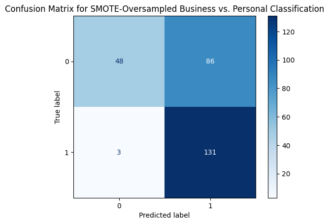

The results indicate that the model performs well in predicting `Business` trips, with high recall (98%) and a decent precision (60%). However, it struggles with accurately identifying `Personal` trips, shown by a low recall (36%) despite high precision (94%). This imbalance suggests the model is biased toward predicting `Business` trips, even after using SMOTE to balance the training data. Improvement could be achieved by further feature engineering, model tuning, or trying different algorithms to enhance the accuracy for the `Personal` category.

## Important Note

To build a comprehensive analysis, we initially focused on classification using a Random Forest model to predict whether a trip was “Business” or “Personal.” This analysis highlighted an imbalance issue, particularly for the “Personal” category, which had significantly fewer data points. To address this, we used techniques like SMOTE for oversampling and downsampling to balance the dataset. Despite these efforts, challenges remained in accurately predicting the minority class, indicating a need for further refinement.

To broaden our analysis and capture more insights, we are now shifting our focus to building other models:

    Duration Prediction Model: A regression model to predict the DURATION of a trip based on features such as MILES, PERIOD, START, and STOP. This can help provide an estimate of trip time, aiding in better trip planning and scheduling.

    Miles Prediction Model: Another regression model to predict MILES, the distance of the trip, using relevant features. This model can be valuable for applications like cost estimation, route optimization, and resource management.

## Linear Regression Model for Predicting the `MILES` Feature:

We applied `StandardScaler()` from sklearn library on the data to acquire a better performing model.

The results of training and testing the model is:

    Linear Regression Performance Metrics (with Normalization):
    Mean Absolute Error (MAE): 5.337538165816426
    Mean Squared Error (MSE): 124.37826010194439
    Root Mean Squared Error (RMSE): 11.15250017269421
    R² Score: 0.5708101647537394

The results from the linear regression model for predicting `DURATION` show a **mean absolute error (MAE)** of approximately **8.28 minutes**, indicating the average deviation of the predicted duration from the actual values. The **root mean squared error (RMSE) of 13.82 minutes** reflects the model’s error magnitude, providing a sense of prediction variability. An **R² score of about 0.535** indicates that around **53.5%** of the variability in trip duration can be **explained by** the model’s features (`MILES`, `PERIOD`, `DAY_OF_WEEK`, `START_ENCODED`, `STOP_ENCODED`). This suggests that the model has **moderate** predictive power but leaves room for improvement, possibly through feature engineering, adding more data, or trying more complex algorithms.

## 20. Final Model Selection

### Which model will you choose as your final model, and why?

- _Compare the performance of different models and justify your final selection based on metrics, complexity, and suitability for your task._

The chosen model is the Random Forest Classifier with SMOTE oversampling. This model showed strong performance, particularly when addressing the data imbalance issue between Business and Personal categories. Using SMOTE effectively balanced the training data, improving classification metrics and ensuring better generalization.

Model Evaluation Summary:

    - Random Forest Classifier with SMOTE achieved high accuracy (~90%) and balanced classification performance, shown through cross-validation and test results.

    - Linear Regression models for predicting MILES and DURATION had moderate R² scores (~0.57 and ~0.53, respectively), useful for numerical predictions but not the main task.

# Part 4: Visualization

## 21. Data Distribution

### How is the data distributed across different features?

- _Visualize the distribution of numerical features using histograms or box plots to identify patterns, outliers, or anomalies. Use bar plots or count plots for categorical features._

---

-1 Miles Distributions:

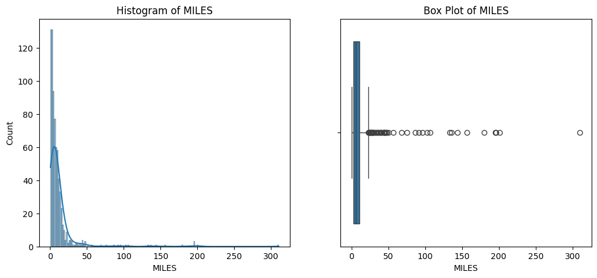

-2 Duration Distributions:

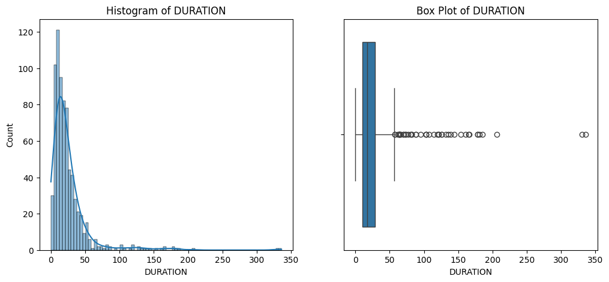

-3 Category Distribution (Business: 1, Personal: 0):

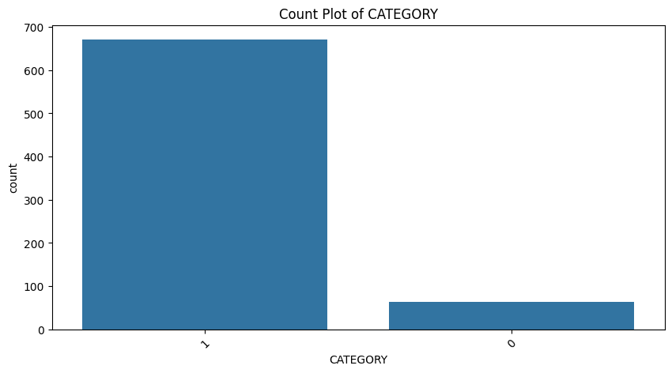

-4 Period Distribution (Morning: 1, Afternoon: 2, Evening: 3, Night: 4):

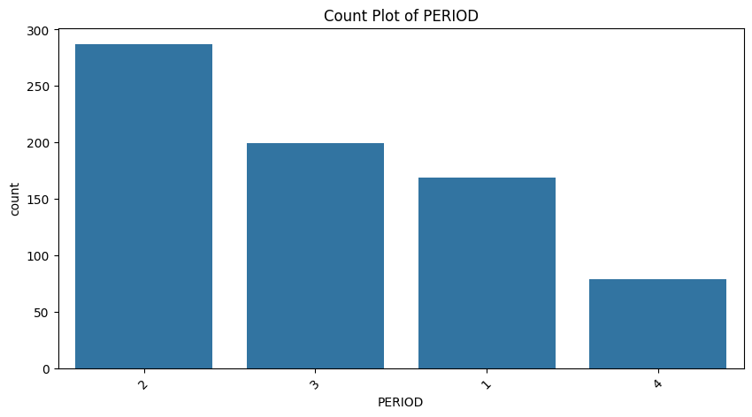

-5 Day of the week distribution (Monday: 1, Tuesday: 2, Wednesday: 3, Thursday: 4, Friday: 5, Saturday: 6, Sunday: 7):

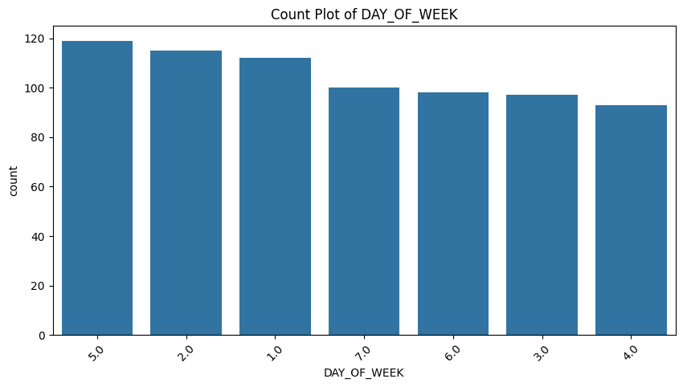

-6 Encoded Start City Distribution (Highest city: Cary)


-7 Encoded Stop City Distribution (Highest city: Cary)

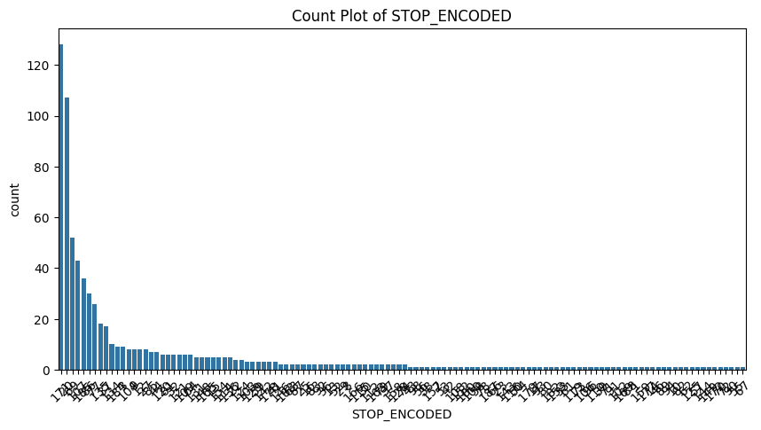

## 22. Feature Importance

### What are the most important features in your model?

_After training your model, visualize feature importance using bar charts (e.g., for tree-based models) or coefficients (e.g., for linear models) to highlight the most influential features._

## Visualizing Feature Importance (Tree-Based Model):

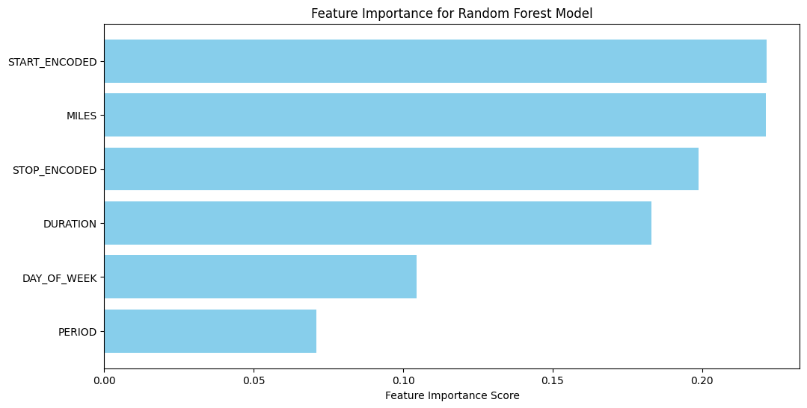

## Visualizing Coefficients (Linear Model):

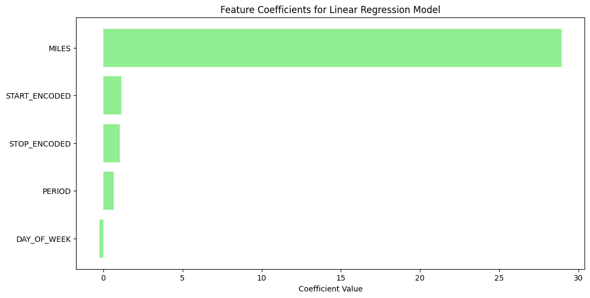

## Model Performance Across Features

### How does the model perform across different subsets of features or data?

- _Use visualizations to show how different features impact model predictions and assess performance variations across data subsets._

        Performance for Subset 1: MILES and DURATION:
        R² Score: -0.7721

        Performance for Subset 2: PERIOD and DAY_OF_WEEK:
        R² Score: -2.5442

        Performance for Subset 3: MILES, START_ENCODED, and STOP_ENCODED:
        R² Score: -0.3502

        Performance for Subset 4: All Features:
        R² Score: -0.0126

  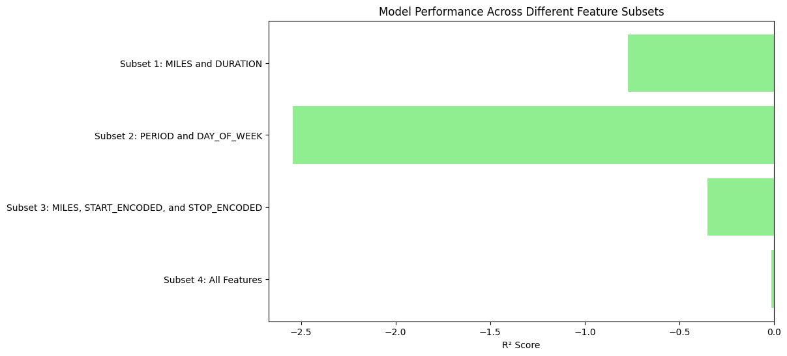
